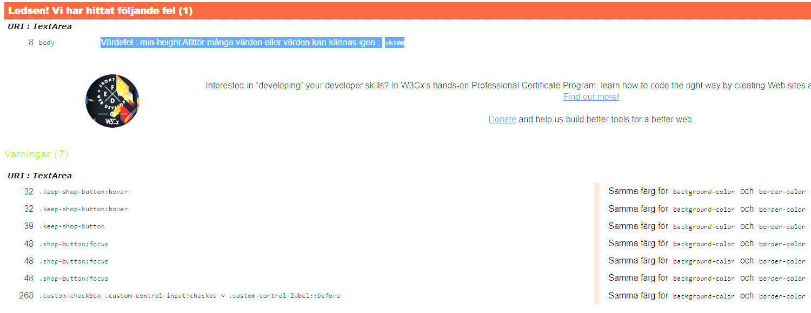
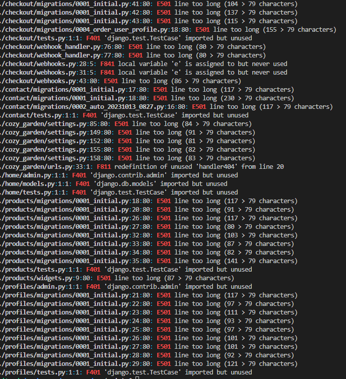
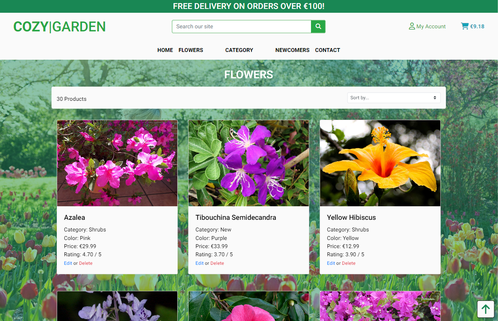
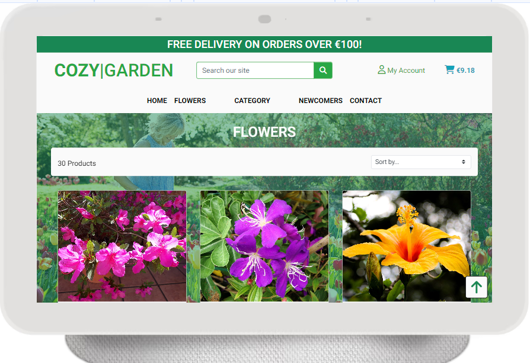
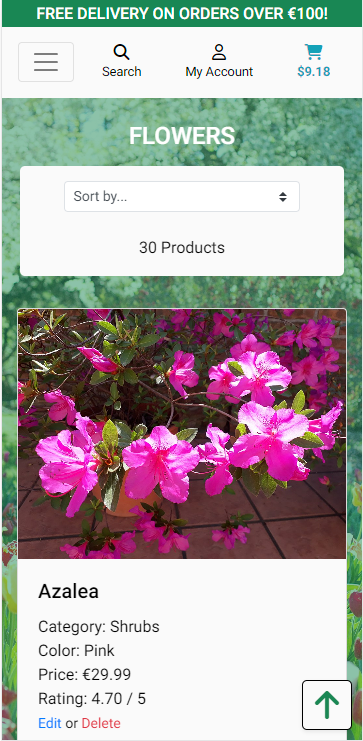
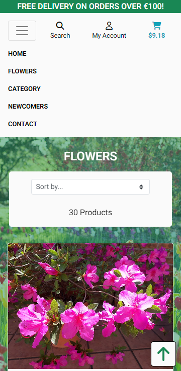

# Book A Contractor

## Introduction
This is a website where anyone can visit to buy their flower seeds to plant at home. By selling seeds instead of live plants we can ship all over the world but still be cost effective.

[View the live project here](https://cozy-gardenbrm-e89d3ea43ad4.herokuapp.com/)

[Link to Github Repository](https://github.com/BjornRodin/cozy-garden)

## Table of Content
- [Introduction](#introduction)
- [User Experience (UX)](#user-experience-ux)
    - [Introduction](#introduction-1)
    - [User Stories](#user-stories)
        - [Site User](#site-user)
        - [Site Admin & Owner](#site-admin--owner)
    - [Design](#design)
        - [Graphics](#graphics)
        - [Database Schema](#database-schema)
        - [Wireframes](#wireframes)
- [Features](#features)
    - [Existing Features](#existing-features)
    - [Future Features](#future-features)
- [Testing](#testing)
    - [User Stories Testing](#user-stories-testing)
       - [As a user I can quickly get in contact with the store owners so that I can ask my questions](#as-a-user-i-can-quickly-get-in-contact-with-the-store-owners-so-that-i-can-ask-my-questions)
       - [As a user I can easily find where to login and logout so that I can login quickly aswell as logging out](#as-a-user-i-can-easily-find-where-to-login-and-logout-so-that-i-can-login-quickly-aswell-as-logging-out)
       - [As a user I can expect to find potential social media links and contact information in the footer so that I can always find the sites information regardless of where on the site I am](#as-a-user-i-can-expect-to-find-potential-social-media-links-and-contact-information-in-the-footer-so-that-i-can-always-find-the-sites-information-regardless-of-where-on-the-site-i-am)
       - [As a user I can register to the site so that see my profile](#as-a-user-i-can-register-to-the-site-so-that-see-my-profile)
       - [As a user I can always view the current order total so that I always know how much i'm about to spend so I can adjust if needed](#as-a-user-i-can-always-view-the-current-order-total-so-that-i-always-know-how-much-im-about-to-spend-so-i-can-adjust-if-needed)
       - [As a user I can navigate the site easily so that I know where I can find certain things](#as-a-user-i-can-navigate-the-site-easily-so-that-i-know-where-i-can-find-certain-things)
       - [As a user I can select the quantity of the item that I want to buy so that I can add the correct amount directly to the cart](#as-a-user-i-can-select-the-quantity-of-the-item-that-i-want-to-buy-so-that-i-can-add-the-correct-amount-directly-to-the-cart)
       - [As a user I can go to the checkout page and view a summary of my order and add my details for the delivery so that review my order again and add my order details](#as-a-user-i-can-go-to-the-checkout-page-and-view-a-summary-of-my-order-and-add-my-details-for-the-delivery-so-that-review-my-order-again-and-add-my-order-details)
       - [As a user I can login to my profile and view my order history so that see what I have bought before](#as-a-user-i-can-login-to-my-profile-and-view-my-order-history-so-that-see-what-i-have-bought-before)
       - [As a user I can view details about each product so that I better understand what it is and if I want to buy it or not](#as-a-user-i-can-view-details-about-each-product-so-that-i-better-understand-what-it-is-and-if-i-want-to-buy-it-or-not)
       - [As a user I can view all products so that I can find what I want to buy](#as-a-user-i-can-view-all-products-so-that-i-can-find-what-i-want-to-buy)
       - [As a user I can view my order confirmation directly when the order is made aswell as getting an email with the information so that I can double check my order and have the confirmation available if needed at a future date](#as-a-user-i-can-view-my-order-confirmation-directly-when-the-order-is-made-aswell-as-getting-an-email-with-the-information-so-that-i-can-double-check-my-order-and-have-the-confirmation-available-if-needed-at-a-future-date)
       - [As a user I can search for a specific product so that I can find it quickly](#as-a-user-i-can-search-for-a-specific-product-so-that-i-can-find-it-quickly)
       - [As a User I can edit my default delivery information in my profile so that I can keep it updated](#as-a-user-i-can-edit-my-default-delivery-information-in-my-profile-so-that-i-can-keep-it-updated)
       - [As a user I can adjust the quantity of my chosen items inside my cart so that make changes if needed before purchasing](#as-a-user-i-can-adjust-the-quantity-of-my-chosen-items-inside-my-cart-so-that-make-changes-if-needed-before-purchasing)
       - [As a user I can view all the products in my cart so that I get an overview of the items that is added](#as-a-user-i-can-view-all-the-products-in-my-cart-so-that-i-get-an-overview-of-the-items-that-is-added)
       - [As a Admin I can update product information so that I can handle any changes I want or need to make](#as-a-admin-i-can-update-product-information-so-that-i-can-handle-any-changes-i-want-or-need-to-make)
       - [As a admin I can delete any products from the site so that control whenever I want to remove something from the shop](#as-a-admin-i-can-delete-any-products-from-the-site-so-that-control-whenever-i-want-to-remove-something-from-the-shop)
    - [Automated Testing](#automated-testing)
        - [W3C Markup Validation Service](#w3c-markup-validation-service)
            - [Home Page](#home-page)
            - [Register Page](#register-page)
            - [Login Page](#login-page)
            - [My Profile](#my-profile)
            - [Manage Products](#manage-products)
            - [Logout Page](#logout-page)
            - [All Products](#all-products)
            - [Flower Details](#flower-details)
            - [Contact](#contact)
            - [Shopping Cart](#shopping-cart)
            - [Checkout Cart](#checkout-cart)
            - [Confirmation Page](#confirmation-page)
        - [W3C CSS Validation Service](#w3c-css-validation-service)
        - [Python Validator](#python-validator)
        - [Google Lighthouse performance test](#google-lighthouse-performance-test)
    - [Manual Testing](#manual-testing)
        - [Features Test](#features-test)
        - [Responsiveness](#responsiveness)
- [Bugs](#bugs)
- [Technologies](#technologies)
    - [Requirements](#requirements)
- [Deployment](#deployment)
    - [ElephantSQL](#elephantsql)
    - [Gitpod & Github](#gitpod--github)
    - [Deployment to Heroku](#deployment-to-heroku)
    - [Version Control](#version-control)
    - [AWS](#aws)
- [Credits](#credits)
    - [Media](#media)
    - [Code](#code)
    - [Content](#content)
- [Acknowledgements](#acknowledgements)

## User Experience (UX)

### Introduction
The goal for this website is to make premium plants of different types available for everyone to purchase, no matter where in the world you are located. By entering our site you can clearly understand what it is we are doing and take a look at the different plants that we currently have in stock. Instead of selling live plants we focus on seeds, our customers could be anyone who want to make their garden prettier and looking nicer. Whatever your location or what type of garden you plan on having in the future, we can supply you with the needed supplies. 

### User Stories
The project was made with agile methods and can be seen in the repository in the [Project Board](https://github.com/users/BjornRodin/projects/8) where also more comments can be found.

Below is a outtake from that page:

#### Site User
- As a user I can quickly get in contact with the store owners so that I can ask my questions
- As a user I can easily find where to login and logout so that I can login quickly aswell as logging out
- As a user I can expect to find potential social media links and contact information in the footer so that I can always find the sites information regardless of where on the site I am
- As a user I can register to the site so that see my profile
- As a user I can always view the current order total so that I always know how much i'm about to spend so I can adjust if needed
- As a user I can navigate the site easily so that I know where I can find certain things
- As a user I can select the quantity of the item that I want to buy so that I can add the correct amount directly to the cart
- As a user I can go to the checkout page and view a summary of my order and add my details for the delivery so that review my order again and add my order details
- As a user I can login to my profile and view my order history so that see what I have bought before
- As a user I can view details about each product so that I better understand what it is and if I want to buy it or not
- As a user I can view all products so that I can find what I want to buy
- As a user I can view my order confirmation directly when the order is made aswell as getting an email with the information so that I can double check my order and have the confirmation available if needed at a future date
- As a user I can search for a specific product so that I can find it quickly
- As a User I can edit my default delivery information in my profile so that I can keep it updated
- As a user I can adjust the quantity of my chosen items inside my cart so that make changes if needed before purchasing
- As a user I can view all the products in my cart so that I get an overview of the items that is added

#### Site Admin & Owner
- As a Admin I can update product information so that I can handle any changes I want or need to make
- As a admin I can delete any products from the site so that control whenever I want to remove something from the shop

### Design

#### Graphics
Generally the graphics I was going for was to make it as simple and clear as possible for anyone who visits the website. I did not want it to be cluttered in any way, shape or form. The focus should be on the content, and that is what I believe i've done.

- Colors that was chosen for the different elements was extracted from the background image.

    

- These colors was then put into a contrast grid to give an understanding of how the different colors would look against white and black text colors.

    

#### Database Schema
[Lucidchart](https://www.lucidchart.com) was used to create a relationship table for the models.

#### Wireframes
The wireframes that I made was, once again, really nice to have to not only design the page, but also to be able to do a better decision regarding the scope of the project. That is what this is for, to get a better understanding of our thoughts and then make decisions based on other things, like time constraints, knowledge, what the website "Must have" and what it "Could have". 

Below is the wireframes:

## Features

### Existing Features
- Nav-bar when logged out & when logged in
    
    
    
- Book a session button on home page

    
- Sign up form

    
- Login functionality

    
- When logged in, profile can be viewed and the user can update their delivery information and view previous orders.

    
    
- Any user can view the contact page and a form can be seen and submitted with relevant information.

    
- When the user click 'Logout' in the navbar the user is presented with a message and button to make sure that's what they want to do.

    
- When viewing a specific product the user can view more details about the product and decide how many to buy with simple interface.

    
- When the user updated the shopping cart in any way a message is shown to the user. This is also where other messages is shown to the user if something is updated, errors, login and logut successes etc.

    

- If there is no content in the shopping cart the information is specified. And of course, if there is content then that is shown.

    
    

- A checkout cart is also available, presenting the items in the cart, a summary and then the delivery information with a payment method.

    
    

- When the user make a purchase an confirmation is shown to the viewer aswell as a confirmation email is sent.

    

- When a admin want to add a product, they can do that aswell from their product management page which is only visible for admins, not regular logged in users. They can also edit an existing product in the same way. If they want to they can also delete products, either directly from the products page or in product details.

    
    
    

### Future Features
- Registering to the site using Facebook or Google.
- Have more images for each type of flower to give the user a better understanding on how it looks more than the actual flower itself.
- Give the users more sorting variables, for example where they could choose which type of soil they have at home and we recommend which plants would be the best. 
- Having more products than flower seeds, could have additional items that would be needed when planting these seeds. Soil, tools and so on.

## Testing

### User Stories Testing

#### As a user I can quickly get in contact with the store owners so that I can ask my questions
- In the navbar there is a contactlink visible for all users, clicking that presents the user with a contactform which will send an email to the admins. Also if they look in the footer there is also a link to socials and to more contact information.

#### As a user I can easily find where to login and logout so that I can login quickly aswell as logging out
- Yes they can. Again in the navbar the "my account" is visible. Clicking that is intuitive for the user. When they are logged in the "login" will be changed to "logout" instead to make it clear what is going on.

#### As a user I can expect to find potential social media links and contact information in the footer so that I can always find the sites information regardless of where on the site I am
- The footer is always at the bottom of the page and never changes. That means that the user can always expect to find the relevant social media links at the same location aswell as contactinformation and privacy policy.

    

#### As a user I can register to the site so that see my profile
- Yes the user can register in the "my account" dropdown. When they are registered, confirmed their email and logged in the "my profile" will be visible in the same dropdown.

#### As a user I can always view the current order total so that I always know how much i'm about to spend so I can adjust if needed
- Yes, the shopping cart in the upper right corner always display the total sum of the current items. Clicking the cart sends user to the shopping cart for more information.

#### As a user I can navigate the site easily so that I know where I can find certain things
- Yes the navbar is never changing (except for small screens when the menu is a dropdown instead). By having it looking the same all the time the user can always rely on finding their way around the website regardless where they currently are located.

#### As a user I can select the quantity of the item that I want to buy so that I can add the correct amount directly to the cart
- When an item is clicked and the user is sent to the product detail view they can choose how many items they want to add to the cart. 

#### As a user I can go to the checkout page and view a summary of my order and add my details for the delivery so that review my order again and add my order details
- Yes they can. In the checkout page they have a summary of all items in their cart and if they want to order the orderform is simple to understand.

#### As a user I can login to my profile and view my order history so that see what I have bought before
- When logged in the user can visit their profile, in the profile view they can see previous orders they've made. In the first view they can see summarys of their previous orders, when clicking a ordernumber they can see the confirmation they were shown when the order was made.

#### As a user I can view details about each product so that I better understand what it is and if I want to buy it or not
- When a product is clicked the user will be sent to a product details page. On that page they are presented with more information than before so they can make better informed decisions.

#### As a user I can view all products so that I can find what I want to buy
- From the navbar it is easy to understand where to find the products. From one of the dropdowns they can view all items in the store.

#### As a user I can view my order confirmation directly when the order is made aswell as getting an email with the information so that I can double check my order and have the confirmation available if needed at a future date
- When the order is made the user is presented with a confirmation page with a summary of their orderinformation. A confirmation email is also sent to the buyer to the email they entered in previous step.

#### As a user I can search for a specific product so that I can find it quickly
- If the user have something specific they want to search for then they can use the searchbar. The search is then done not only on the names of the products, but also on the other information we have available on the products. That will help the user have an easier time finding what they are looking for. If they want a "pink" flower for example they can search for that and all products with "pink" in it will be visible to the user.

#### As a User I can edit my default delivery information in my profile so that I can keep it updated
- In the profile when the user is logged in they are presented with a form where they can either preset their delivery information or update it if it is already populated with information.

#### As a user I can adjust the quantity of my chosen items inside my cart so that make changes if needed before purchasing
- In the shopping cart the user can update their content of the cart. Either they can add/remove the selected items or remove it completely from their cart.

#### As a user I can view all the products in my cart so that I get an overview of the items that is added
- In the shopping cart the user can see all their added products with the images and names for example

#### As a Admin I can update product information so that I can handle any changes I want or need to make
- The admin can directly from the website choose to edit a product, when clicking edit they are sent to a form with prepopulated information regarding this product, the admin can edit any of the fields.
- In the same way the admin can add products, from their product management view they are presented with the same form as when editing products, but now it is empty. The admin has some required fields to enter but can leave others blank if necessary.

#### As a admin I can delete any products from the site so that control whenever I want to remove something from the shop
- The admin can from the website, just as with editing, delete a product. When delete is clicked the item will be removed from the shop.

### Automated Testing

#### W3C Markup Validation Service
This is how I did it.

To validate the HTML code in this project and not get errors because of the Django template tags I followed these steps:
1. Navigated to the deployed website in google chrome
2. Navigate to the specific page to test
3. Right-click the page and above "Inspect" there should be a "View Source code" or "View page source"
4. Copy all the code that appears
5. Go to [W3C Markup Validator](https://validator.w3.org/#validate_by_input) and choose "Direct input"
6. Then paste the code and press "Check" to validate code

##### Home Page
- Some error was found, "li" elements has to be wrapped in "ul" for example.
- All issues was solved

##### Register Page
- No errors or warnings to show

##### Login Page
- No errors or warnings to show

##### My Profile
- A warning was visible for javascript type being unecessary. Issue was solved.

##### Manage Products
- There was an error for a "p" element being wrapped in a "strong" element. I solved that issue.
- The other error with duplicate "id"s being set to the input field at custom_clearable_file_input.html is because we have an id set as standard. The script selects the inputfield using this id and attaches a event listener to the element. When a file is selected the function is executed which then updates the p element with an id of the filename. I can't find a solution to this and when testing, everything is working as intended so I believe it is okay.

##### Logout Page
- No errors or warnings to show

##### All Products
- No errors or warnings to show

##### Flower Details
- A warning was visible for javascript type being unecessary. Issue was solved.

##### Contact
- No errors or warnings to show

##### Shopping Cart
- A warning was visible for javascript type being unecessary. Issue was solved.

##### Checkout Cart
- A warning is visible for a heading being empty. But it is not empty, it has a fontawesome spinner. For that reason I will leave that as it is.

##### Confirmation Page
- No errors or warnings to show

#### W3C CSS Validation Service
This was done using [Jigsaw](https://jigsaw.w3.org/css-validator/#validate_by_input) and copying all code from css as a direct input.
- base.css
    - Some errors were found, first that i had written "vh100" instead of "100vh", this was solved.
    - The other errors, says that I have set the same color for both background and borders of some buttons. This was solved by removing the border entirely.
    - The checkbox I will keep as is because I want the border and both needs to be the same color.

- profile.css
    - No errors or warnings

- checkout.css
    - No errors or warnings

#### Python Validator
To check the Python code in this project I used the command in the terminal "python3 -m flake8"
Most warnings was due to missing endline, code being too long, wrong indentation, trailing whitespaces.
I could solve most of them but some couldn't be solved because the code couldn't be refactored. I did try but when I did I broke the function of the code. However, now almost all of my own files is fixed, the rest is files that is automatically generated and i have not touched those.

Below is an image of how it is now looking:

#### Google Lighthouse Performance Test
The tests are all made in the same way:
1. In incognito-mode
2. The same configuration is used, showed in below image. Only 'Device' was changed in between the tests.
    
    

- Desktop
    -  Not very much to say more than that the scoring is really good

    
- Mobile
    - Score is slightly lower for mobile devices than on the desktop but still a good score and i'm happy with that.

    

### Manual Testing

#### Feature Test
Tested according to below image and passing everything.

#### Responsiveness
The responsiveness of the website was tested with google chromes devtools and was tested with all devices available there. Below is a few images from different sizes.
I can't find any responsive design issues on any of the pages. The images are, in order: Desktop, Nest Hub, Galaxy S8 and another to show the dropdown meny for navbar on smaller screensizes.

## Bugs
The bugs that I encountered are all mostly visible in the [Project Board](https://github.com/users/BjornRodin/projects/7). I say 'mostly' because not all the minor bugs is reported there but instead reported in a commit message in the repository. What i've tried to do is to atleast mention the major bugs and discussing them before finding the solution and mentioning those aswell of course. In any case, below is a list of bugs that was encountered and how they was solved.

I will definitely take with me is that using the Project Board is an amazing tool to keep track of the items that are being worked on and any history related to that development. In future projects and when going into the field of working as a programmer I will be spending as much time as possible organizing this page to not only keep my work updated, but also be able in detail to show anyone else what has been done and when it was implemented. 

## Technologies
- [Code Institute Template](https://github.com/Code-Institute-Org/gitpod-full-template) was used during this project.
- [GitHub](https://github.com/) is the host which is used to store the code.
- [Git](https://git-scm.com/) was used to commit and push the code to the GitHub repository and works as a version control software. 
- [Lucidchart](https://www.lucidchart.com) was used to create the diagram.
- [Google Chrome Lighthouse](https://developers.google.com/web/tools/lighthouse) was used when testing the site.
- Flake8 in the commandline terminal was used to validate the Python-code.
- [Heroku](www.heroku.com) project is deployed to Heroku to make it into an app that is accessible through a browser.
- [Balsamiq](https://balsamiq.com/) was used to create the wireframes.
- [Google Fonts](https://fonts.google.com/) was used to import the fonts that was used.
- [Google Chrome Developer Tools](https://developer.chrome.com/docs/devtools/overview/) was used during the whole project, especially while debugging and making it responsive for different screen-sizes.
- [W3C HTML Validator](https://validator.w3.org/) was used to check for errors in the HTML code in the end of the project.
- [W3C CSS Validator](https://jigsaw.w3.org/css-validator/) was used to check for errors in the CSS code in the end of the project.
- [Pexels](https://www.pexels.com/sv-se/) was used to find the background image for the site.
- [Adobe Color](https://color.adobe.com/sv/create/image) was used to extract colors from the background image.
- [Contrast Grid](https://contrast-grid.eightshapes.com/) Was used to see how the different color would contrast against black and white texts.
- [Fontawesome](https://fontawesome.com/start) to get icons for the project.
- [Favicons](https://favicon.io/) was used to add a favicon to the browser.
- [Freeiconspng](https://www.freeiconspng.com/downloadimg/23483) was used to find the 'no image' image
- [Bootstrap](https://getbootstrap.com/docs/5.3/getting-started/introduction/) was used to build the website.
- [ElephantSQL](https://www.elephantsql.com/) provides the project with PostgreSQL databases.
- [Django](https://www.djangoproject.com/) provides a Python web framework.
- [Stripe](https://stripe.com/se) was used to handle payments on the site.
- [Rapidtables](https://www.rapidtables.com/convert/color/hex-to-rgb.html) was used to convert hex colors to rgb
- [Gitpod](https://gitpod.io/workspaces) was used to code the project
- [XMLSITEMAPS](https://www.xml-sitemaps.com/) was used to create the xmlsitemap
- [Mailchimp](https://mailchimp.com/) was used to handle and create the newsletter signup
- [Privacypolicygenerator](https://www.privacypolicygenerator.info/) was used to generate a privacy policy
- [Wikipediacommons](https://commons.wikimedia.org/wiki/Main_Page) was used to find the images of all the flowers
- [AWS](https://aws.amazon.com/) was used to store static files 

### Requirements
Full list of all the libraries and packages in the requirement.txt file

- asgiref==3.7.2
- boto3==1.28.63
- botocore==1.31.63
- dj-database-url==0.5.0
- Django==3.2.22
- django-allauth==0.41.0
- django-countries==7.2.1
- django-crispy-forms==1.14.0
- django-storages==1.14.2
- gunicorn==21.2.0
- jmespath==1.0.1
- oauthlib==3.2.2
- Pillow==10.0.1
- psycopg2==2.9.9
- python3-openid==3.2.0
- pytz==2023.3.post1
- requests-oauthlib==1.3.1
- s3transfer==0.7.0
- sqlparse==0.4.4
- stripe==6.7.0
- urllib3==1.26.17

## Deployment 

### ElephantSQL
Create external database for app data
1. Create an account at [ElephantSQL](https://www.elephantsql.com/)
2. Click "Create New Instance"
3. Type a name for for your plan, usually the projectname. 
4. Select "Tiny Turtle (Free)". 
5. Leave tags field empty 
6. Select your region
7. Select a data center near your location from the list
8. Click "Review"
9. Check your details, then click "Create instance"
10. Return to dashboard and click on your database
11. In the URL section, click the icon to copy the database URL

### Gitpod & Github
1. Create repository in Github using the provided [Code Institute template](https://github.com/Code-Institute-Org/gitpod-full-template)
2. Give your repository a name
3. Click "Create Repository"
4. Open with Gitpod
5. In Gitpod, install all the libraries and packages mentioned in "Requirements"
6. Create your requirements.txt file with command "pip3 freeze --local > requirements.txt"
7. Create a "env.py" file in your project
8. Make sure to add it to your ".gitignore" file
9. In "env.py" file, set this code (on separate lines)
    - import os
    - os.environ["DATABASE_URL]="Your ElephantSQL URL here"
    - os-environ["SECRET_KEY]="your secret key here"
10. Save the file
11. In your settings.py file, enter the following code below your "Path" import
    - import os
    - import dj_database_url
    - if os.path.isfile('env.py'):
        import env
12. Further down, find "SECRET_KEY"
    - Change the previous set key to 'SECRET_KEY' 
13. Next, comment out the original DATABASES variable and type this one below
    - DATABASES = {
        'default': dj_database_url.parse(os.environ.get("DATABASE_URL))
    }
14. Save file
15. Now type this command in the terminal
    - python manage.py migrate
16. Push to github with the following commands in the terminal, one by one
    - git add .
    - git commit -m "commit message"
    - git push
### Deployment to Heroku
1. Assuming you have a Heroku account, otherwise you have to create one.
2. In Heroku, click "Create a new app".
    - Give the app a valid name (names are unique).
    - Then choose your region.
    - Lastly click "Create app"
3. In the tabs, click "Settings".
4. Scroll down to "Config Vars", click "Reveal Config Vars".
    - Add a "Config Var".
        - In the field "KEY", type "DATABASE_URL".
        - In the field "VALUE", paste your "postgres" link from ElephantSQL.
        - Then click "Add"
    - Add another "Config Var".
        - In the field "KEY", type "SECRET_KEY".
        - In the field "VALUE", enter your "secret key".
        - Then click "Add"
    - Add another "Config Var".
        - In the field "KEY", type "AWS_ACCESS_KEY_ID".
        - In the field "VALUE", enter your key.
        - Then click "Add"
    - Add another "Config Var".
        - In the field "KEY", type "AWS_SECRET_ACCESS_KEY".
        - In the field "VALUE", enter your key.
        - Then click "Add"
    - Add another "Config Var".
        - In the field "KEY", type "EMAIL_HOST_PASS".
        - In the field "VALUE", enter your key.
        - Then click "Add"
    - Add another "Config Var".
        - In the field "KEY", type "EMAIL_HOST_USER".
        - In the field "VALUE", enter your key.
        - Then click "Add"
    - Add another "Config Var".
        - In the field "KEY", type "STRIPE_PUBLIC_KEY".
        - In the field "VALUE", enter your key.
        - Then click "Add"
    - Add another "Config Var".
        - In the field "KEY", type "STRIPE_SECRET_KEY".
        - In the field "VALUE", enter your key.
        - Then click "Add"
    - Add another "Config Var".
        - In the field "KEY", type "STRIPE_WH_SECRET".
        - In the field "VALUE", enter your key.
        - Then click "Add"
    - Add another "Config Var".
        - In the field "KEY", type "USE_AWS".
        - In the field "VALUE", enter "True".
        - Then click "Add"
6. Scroll up and from the menu-tab, click "Deploy".
    - In "Deployment method", choose "GitHub" by clicking it.
    - In "Connect to GitHub", click "Connect to GitHub".
    - In "Connect to GitHub" there now is a searchbar, enter your repository name and then click "Search".
    - Your repository should appear, click "Connect" next to it.
7. Scroll down so you can see "Automatic deploys" and "Manual deploy".
    - You can choose either option.

You have now deployed your project to Heroku!

### Version Control
- A repository was made on Github with Code Institutes Template.
- Coding for the site was done on the [Gitpod](https://www.gitpod.io/) platform.
- Code was added to the staging area with the 'git add .' command.
- The changes in the staging area was committed with the 'git commit -m " "' command.
- All committed code was pushed to Github repository with the 'git push' command.

### AWS
1. In the search bar look for S3
2. Create your new bucket , preferably matching your heroku project name and choose your region.
3. Uncheck the "Block all public access" option.
4. Enable ACLs under "Object Ownership" and select "Bucket owner preferred".
5. In the "Properties" tab, activate static website hosting and enter "index.html" and "error.html" in the respective fields.
6. Paste the following CORS configuration under the "Permissions" tab :

        [
            {
                "AllowedHeaders": ["Authorization"],
                "AllowedMethods": ["GET"],
                "AllowedOrigins": ["*"],
                "ExposeHeaders": []
            }
        ]
7. Take a note of your ARN string.
8. Go to "Bucket Policy" tab and select "Policy Generator".
9. Set the "Policy Type" as "S3 Bucket Policy", "Effect" as "Allow", "Principal" as "*", "Actions" as "GetObject" and paste your ARN into the "Amazon Resource Name(ARN)" field.
10. Generate the policy, copy it and paste into the Bucket Policy Editor.

        {
            "Id": "Policy1234567890",
            "Version": "2012-10-17",
            "Statement": [
                {
                    "Sid": "Stmt1234567890",
                    "Action": ["s3:GetObject"],
                    "Effect": "Allow",
                    "Resource": "arn:aws:s3:::your-bucket-name/*",
                    "Principal": "*"
                }
            ]
        }
11. Append "/*" to the end of the "Resource" key before saving.
12. In the ACL( Access Control List ) section, enable "List", for Everyone.
13. Open IAM (Identity and Access Management) service.
14. Create a new user group, you can name it "group-your-app-name".
15. Select the group you created, navigate to the "Permissions" tab, click "Add Permissions", then "Attach Policies"
16. From the JSON tab, select the "Import Managed Policy" link. Search for S3, select the "AmazonS3FullAccess" policy, then "Import". Paste your ARN from the S3 Bucket into "Resources" key:

        {
            "Version": "2012-10-17",
            "Statement": [
                {
                "Effect": "Allow",
                "Action": "s3:*",
                "Resource": [
                    "arn:aws:s3:::your-bucket-name",
                    "arn:aws:s3:::your-bucket-name/*"
                ]
                }
            ]
        }

17. Review the policy and create it.
18. Attach this policy to your group.
19. Add a new user to the group. Select "Programmatic Access" as the AWS Access Type. Download the .csv file with the user's Access key ID and Secret Access Key.
20. In the S3 create a new folder called media which will hold your image files.
21. Upload all the required files for your project into this folder.
22. Make sure the "Manage Public Permissions" is set to "Grant Public Read Access to this object(s)"

- Then we make some adjustments in the workspace we have

1. First we Install the packages :

        pip3 install boto3
        pip3 install django-storages

2. Next add the 'storages' into the INSTALLED_APPS in settings.py in your project folder.
3. Add your AWS secret variables into the env.py file or as variables in your settings in Gitpod for example.

- Then we set some settings in settings.py

1. Initial settings / imports at the top of the file.

        import os
        from pathlib import Path
        import dj_database_url

        if os.path.isfile("env.py"):
            import env

2. Secret Key settings : (Note always keep these secret)!

        SECRET_KEY = os.environ.get("SECRET_KEY")

        DEBUG = "DEVELOPMENT" in os.environ 

3. Database settings : This will be the secret url that you have set in the env.py file or in your variables in the settings of Gitpod.

        DATABASES = {
            'default': dj_database_url.parse(os.environ.get('DATABASE_URL'))
        }

4. Media and Static files : 

        STATIC_URL = '/static/'
        STATICFILES_DIRS = (os.path.join(BASE_DIR, 'static'),)

        MEDIA_URL = '/media/'
        MEDIA_ROOT = os.path.join(BASE_DIR, 'media')

5. Add the following imports into your URLS.py in your project folder.

        from django.conf import settings
        from django.conf.urls.static import static

        followed by the following command at the end of the urlpatterns: 

        urlpatterns = [
            path(your paths),
        ]+ static(settings.MEDIA_URL, document_root=settings.MEDIA_ROOT) 

6. Template DIRS setting : 

        TEMPLATES = [
            {
                'DIRS': [
                    os.path.join(BASE_DIR, 'templates'),  *// ADD THIS // *

7. AWS Setup :

        if 'USE_AWS' in os.environ:

            # Cache control
            AWS_S3_OBJECT_PARAMETERS = {
                'Expires': 'Thu, 31 Dec 2099 20:00:00 GMT',
                'CacheControl': 'max-age=94608000',
            }

            # Bucket Config
            AWS_STORAGE_BUCKET_NAME = 'your-storage-bucket-s3-name' // Your S3 name
            AWS_S3_REGION_NAME = 'your-region-1' // Your Region
            AWS_ACCESS_KEY_ID = os.environ.get('AWS_ACCESS_KEY_ID')
            AWS_SECRET_ACCESS_KEY = os.environ.get('AWS_SECRET_ACCESS_KEY')
            AWS_S3_CUSTOM_DOMAIN = f'{AWS_STORAGE_BUCKET_NAME}.s3.amazonaws.com'

            # Static and media files
            STATICFILES_STORAGE = 'custom_storages.StaticStorage'
            STATICFILES_LOCATION = 'static'
            DEFAULT_FILE_STORAGE = 'custom_storages.MediaStorage'
            MEDIAFILES_LOCATION = 'media'

            # Override static and media URLs in production
            STATIC_URL = f'https://{AWS_S3_CUSTOM_DOMAIN}/{STATICFILES_LOCATION}/'
            MEDIA_URL = f'https://{AWS_S3_CUSTOM_DOMAIN}/{MEDIAFILES_LOCATION}/'

8. Create custom_storages.py file in root directory :

        from django.conf import settings
        from storages.backends.s3boto3 import S3Boto3Storage

        class StaticStorage(S3Boto3Storage):
            location = settings.STATICFILES_LOCATION

        class MediaStorage(S3Boto3Storage):
            location = settings.MEDIAFILES_LOCATION

9. Create Procfile in the root directory :

        Once you created the procfile add this command inside : 
        web: gunicorn your_app_name.wsgi:application

10. Change your allowed hosts at the top to the following : 

        ALLOWED_HOSTS = [
        "project_name.herokuapp.com", 
        "localhost", "local_gitpod_workspace_url"]

After this you can add your changes, commit, and then push.

## Credits

### Media
- Thanks [Jill Wellington](https://www.pexels.com/sv-se/@jill-wellington-1638660/) for providing me with the [background-image](https://www.pexels.com/sv-se/foto/landskap-natur-solig-person-413735/)

### Code
- The code that was used in the project was mostly learnt via [Code Institute](https://codeinstitute.net/se/) and their Full Stack Software Development course. Their walkthrough was very good to follow along to not only get started, but also have a better understanding of what we're building and how we can work from what we have.
- Slack was used to search for information, documented in bugs and in the project hub in the repositories.
- [Bootstrap](https://getbootstrap.com/docs/5.3/getting-started/introduction/) was used to build the pages efficiently.

### Content
- The content was designed and written by me.

## Acknowledgements
- Thank you to my family, especially Joakim Rödin, who have supported, pushed and encouraged me during the project.
- The Slack community.